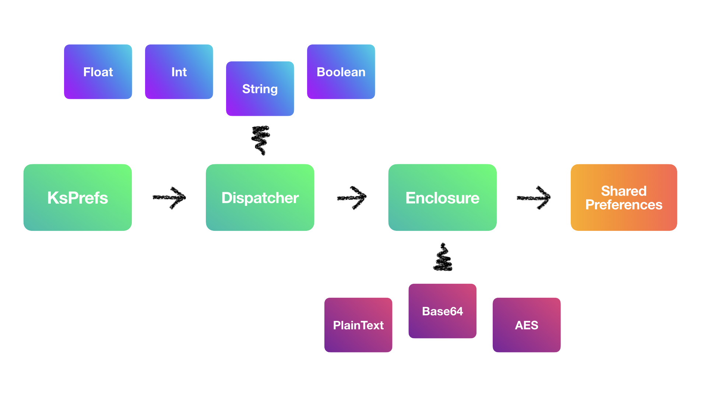

<p align="center">
  <a href="https://github.com/cioccarellia/ksprefs" target="_blank"></a>
</p>
<h1 align="center">KsPrefs</h1>
<p align="center">Simplify SharedPreferences. 100% Kotlin.</p>
<p align="center">
  <a tagret="_blank" href="https://bintray.com/cioccarellia/kurl/kurl/_latestVersion"></a>
  <a tagret="_blank" href="https://app.circleci.com/pipelines/github/cioccarellia/ksprefs"></a>
  <a tagret="_blank" href="https://app.codacy.com/manual/cioccarellia/ksprefs/dashboard"></a>
  <a></a>
  <a></a>
  <a></a>
  <a href="https://github.com/cioccarellia/ksprefs/blob/master/LICENSE"></a>
</p>

### TLDR
```gradle
implementation 'com.cioccarellia.ksprefs:$version'
```

- :zap: Fast SharedPreferences wrapper
- :rocket: Easy to pick up & use right away for any project
- :gear: Configurable behaviour
- :lock: Built-in transformations (PlainText, Base64, AES, Keystore)
- :symbols: Extensive type support
- :heart: Kotlin powered. Standard.

```kotlin
val prefs = KsPrefs(applicationContext)
```

To read from SharedPreferences, you can use `pull(key, default)`.<br>
To write to SharedPreferences, you can use `push(key, value)`.

## Introduction
<br>
KsPrefs (<b>K</b>otlin <b>S</b>hared <b>Pref</b>erences) is a wrapper for the default Android SharedPreferences implementation.
It works by providing control and extensibility to the default API, to create strongly-typed, null safe.
KsPrefs
